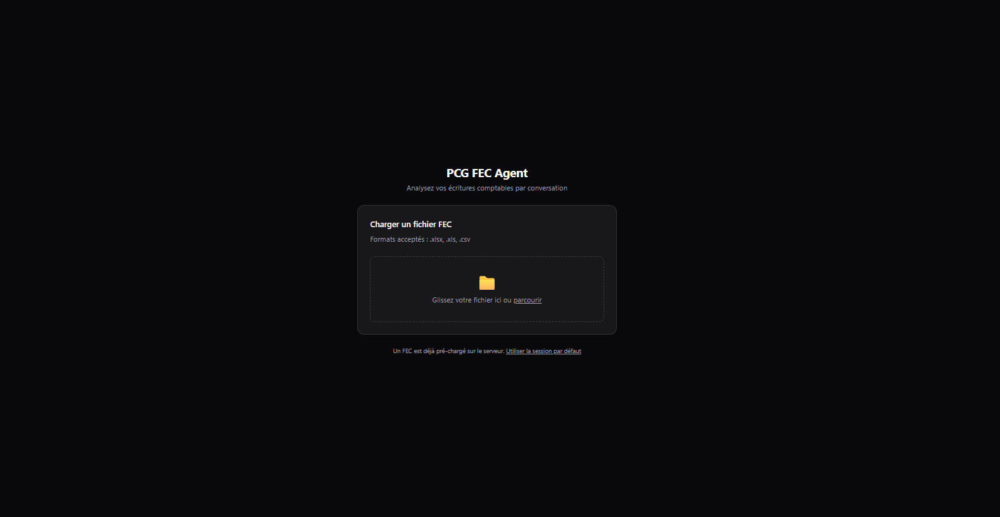
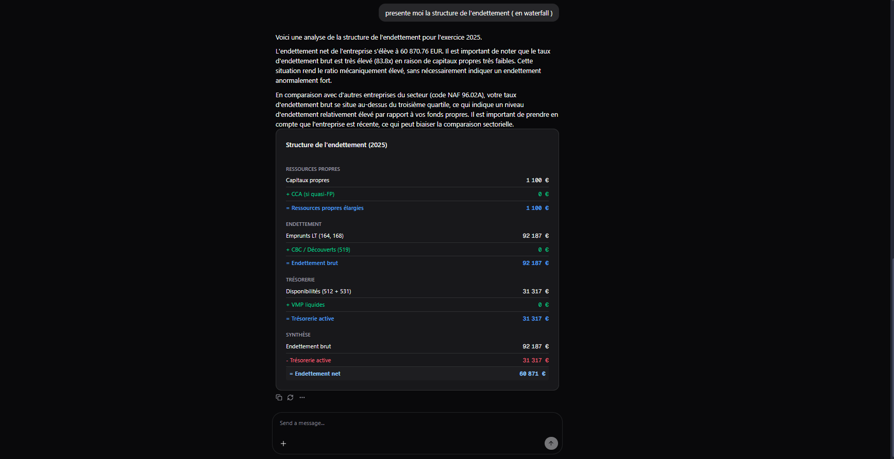

# FEC Agent — Config-Driven Financial Analysis for French FEC Files

Config-driven financial analysis for French **FEC** files: **FastAPI** + LangGraph / Gemini backend, **Next.js** chat UI.

**Benchmark sheet:** [Google Sheet — manual metric checks](https://docs.google.com/spreadsheets/d/1a6Fu6i8RV6OQ2ga7P81xyitQAwysUO_3njSHx20LxAY/edit?usp=sharing) lists metrics computed by hand from the same source data, so you can compare them to the FEC agent’s outputs.

The **semantic layer** (rubriques, SQL generation, LLM-safe descriptions) is config-driven and **leverages MDL**—Modeling Definition Language, in the same spirit as Wren AI’s semantic-layer MDL.

## Run

```bash
pip install -r requirements.txt
# .env → GEMINI_API_KEY
python main.py
```

```bash
cd frontend && npm install && npm run dev
```

API docs: http://localhost:8000/docs · App: http://localhost:3000

## Screenshots



